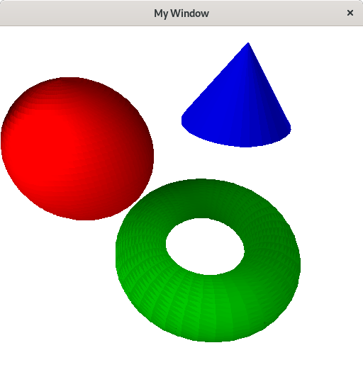

# CS3388 Assignment 3

[Course Website](https://owl.uwo.ca/access/content/group/1b026160-e391-4236-b962-9783a9ab6a99/CS3388-Outline.html)

Due date: Friday March 15th 2019, at 11:00pm.
Weight: 10% of final mark

## Description

This assignment is an extension to assignment 2 and consists of the design and implementation of a program that allows a user to shade objects (spheres, cones, and torii) in various colours. The program to be created will place and scale parametric objects within a scene (using 3D homogeneous transformation matrices) and render them using the shading model found in the class notes. Your program will perform the following:

- Place the synthetic camera, objects, and the light source in the scene (the scene must contain at least one sphere, one cone, and one torus).
- Render the parametric objects in different colours as polygon meshes using the shading model.
- Implement a hidden surface removal algorithm for convex objects, using surface normals.
- Implement a 2D convex polygon filling algorithm. A C implementation of this algorithm is provided below.
- The polygons in the meshes should be small enough for objects to appear smooth.

Once your assignment is completed, submit your source code and a screen capture of the resulting output image through OWL.

To assist you in this assignment, you are given a method written in C that fills [2D convex polygons](/assignment-assets/XFillPolygon.c).

Before submitting your assignment, please refer to the [assignment marking](http://www.csd.uwo.ca/faculty/beau/CS3388/CS3388-Marking-Scheme.html) scheme and [submission guidelines](http://www.csd.uwo.ca/faculty/beau/CS3388/CS3388-Submission.html).

## Instructions to run
### Prerequisites

1. Make sure you have g++ installed. I am using `version 8.2.1`.

2. Make sure you have xlib11 installed. To install it, try `pacman -S xlib11-dev` (in arch linux), probably same name in other package managers.

### Building

1. Compile the program by running `make main` from the project root directory.

### Running

1. Run the program by using `./bin/main`. It should open a window with the expected graphic displayed

2. Close the window by typing 'q' or clicking the 'X' button

## Ouput

## How it works
1. Firstly some objects are made. For the sample scene, I included a sphere, torus and cone. These objects are a collection of Surfaces, which is essentially a triangle in 3D space.

2. Once the objects are made, they are added to the scene. The scene also obtains a light source, which is just a position in 3D space where the light source resides. The lightsource does not have a concept of intensity (ie. the intensity is always 1).

3. A Camera is made, which is able to take the scene and project it to what the window would see through a synthetic camera.

4. Each of the projected objects in the scene is drawn to the screen. The objects' Surfaces calculate their shading, based on the object's base colour as well as the angle between the Surface's normal and a vector pointing to the lightsource.

5. Each Surface, now projected and shade calculated, is drawn using a triangle filling algorithm. This algorithm works by separating the triangle into two more triangles; one with a flat top and one with a flat bottom. From there the process of filling each triangle is simple.  
